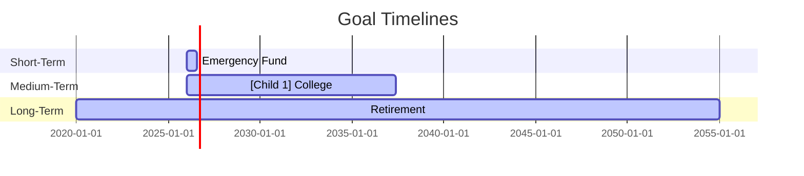

## Cadence
Quarterly

## Purpose
Project every financial goal to its completion date based on current balances and contributions, flag goals at risk of missing their target date, and model contribution adjustments to bring them back on track. Surfaces tradeoffs when goals compete for the same monthly surplus.

## Required Input

Paste the Goals and Savings & Investment Contributions sections from your snapshot, or say "read latest" to load from `data/snapshots/`.

Also provide (if not in snapshot):
- Assumed annual return rate for invested goals (default: 7% real for long-horizon goals, 4% for goals within 5 years, 0% for cash savings goals)
- Any goals you've added or changed since the last snapshot

## Step 1 — Load Data

If "read latest", use Read tool to load from `data/snapshots/`. Extract the Goals table and Savings & Investment Contributions table.

## Step 2 — Project Each Goal

For each goal, compute the projected completion date using the future value formula:

Given:
- Current balance = PV
- Monthly contribution = PMT
- Monthly return rate = r (annual rate ÷ 12)
- Target amount = FV

Solve for n (months to reach target):
- If r > 0: n = ln((FV × r + PMT) ÷ (PV × r + PMT)) ÷ ln(1 + r)
- If r = 0 (cash goal): n = (FV − PV) ÷ PMT

Classify each goal:
- **On track** — projected date is on or before target date
- **⚠ Behind** — projected date is 1–12 months after target date
- **🔴 At risk** — projected date is >12 months after target date, or contribution is $0 with a target date set
- **✓ Complete** — current balance ≥ target amount

For each at-risk or behind goal, compute: **monthly contribution needed to hit target date exactly** (solve for PMT given current PV, target FV, target date n, and assumed r).

## Step 3 — Contribution Reallocation Analysis

If multiple goals are behind or at risk, model the impact of redirecting contributions between them:

1. Show the total monthly contribution currently allocated across all goals
2. If there is any monthly surplus (from snapshot), show what adding it to the highest-priority at-risk goal would do
3. If a lower-priority goal is overfunded (projected to complete early), flag the surplus contributions that could be redirected

Limit to the top 2–3 reallocation scenarios — don't overwhelm with permutations.

## Step 4 — Assumptions

State clearly at the top of the output:
- Return rate assumed per goal type
- Whether contributions are assumed constant (no raises, no changes)
- Inflation not modeled unless the goal amount is explicitly real-dollar

## Output Structure

### Key Numbers
Bold at top: total goals tracked, number on track, number behind, number at risk, total monthly going to goals.

### Goal Progress Table

| Goal | Target $ | Target Date | Current $ | Progress | Projected Date | Status | Gap |
|------|----------|-------------|-----------|----------|----------------|--------|-----|
| Emergency Fund | $45k | Jun 2026 | $32k | 71% | Aug 2026 | ⚠ Behind | +$1,300/mo needed |
| ... | | | | | | | |

### Mermaid Gantt Chart

One bar per goal. Use `done` shading for progress, extend to projected date. Add a milestone marker for the target date where it differs:



### ASCII Fallback (if Mermaid doesn't render)

```
Emergency Fund  ████████████░░░░  71%  ⚠ Behind  (+2mo, need +$X/mo)
College         ████░░░░░░░░░░░░  22%  On track  (2037)
Retirement      ██░░░░░░░░░░░░░░  12%  On track  (2055)
```

### At-Risk Goal Details

For each ⚠ or 🔴 goal:
- **Gap**: projected date vs target date
- **Required adjustment**: $X/mo more to close the gap exactly
- **Trade-off**: what it would take from another goal or surplus

### Contribution Reallocation Scenarios

Only show if reallocation is worth considering:

| Scenario | Change | Effect on [Goal A] | Effect on [Goal B] |
|----------|--------|-------------------|-------------------|
| Redirect $X/mo from [B] to [A] | ... | Closes gap by Xmo | Delays B by Xmo |

### Recommended Adjustments
Numbered action list, ordered by goal priority rank from the snapshot.

## Handoffs
- `/quarterly-strategy` — if goal adjustments should be part of the 90-day plan
- `/budget-diagnosis` — if there's no surplus available to cover goal gaps (need to find it in the budget)
- `/investment-review` — if long-horizon goals need their return assumptions reviewed against actual allocation
- `/scenario-compare` — if there's a major tradeoff decision (e.g., pay off home vs. fund college)
