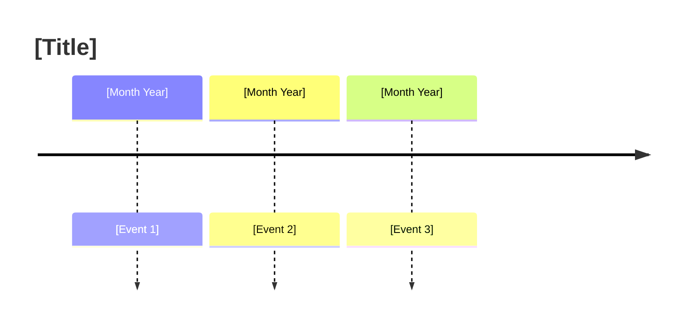

## Cadence
As needed — called from within any analytical skill session

## Purpose
Pure visualization utility. Takes financial data and emits ready-to-render Mermaid syntax. Does no financial analysis. Other skills call this at the end of their output; users can also invoke it directly to visualize any financial data on demand.

## Supported Diagram Types

| Type | Best for |
|------|---------|
| `pie` | Spending breakdown, asset allocation, net worth composition |
| `xychart-beta` (bar) | Budget vs actual by category, contribution headroom by account |
| `xychart-beta` (line) | Debt balance over time, net worth trend, cash flow calendar |
| `gantt` | Goal timelines, debt payoff sequence |
| `timeline` | Quarterly action plan milestones, key financial events |

## How to Use

Describe what you want visualized. Examples:
- "pie chart of my spending: groceries $800, dining $450, utilities $200, entertainment $150"
- "line chart showing debt going from $42k to $0 over 30 months"
- "gantt chart: emergency fund done June 2026, college fund done 2034, retirement done 2055"
- "timeline of my Q2 priorities: pay off card by July, max HSA by September, rebalance by October"

If the request is ambiguous, ask one clarifying question before rendering.

## Output Format

Always output:
1. A fenced ` ```mermaid ``` ` block with valid, ready-to-render syntax
2. A plain-English caption on the line immediately after the closing fence explaining what the diagram shows

## Diagram Templates

### Pie chart


> **Note:** Mermaid `pie` does not support negative values. Never include debt or deficit slices directly. Show liabilities as a separate table alongside the pie if needed.

### XY chart — bar (budget vs actual)
```mermaid
xychart-beta
    title "[Title]"
    x-axis ["Cat 1", "Cat 2", "Cat 3"]
    y-axis "Amount ($)" 0 --> [max]
    bar [budget_values]
    bar [actual_values]
```

### XY chart — line (trend over time)
```mermaid
xychart-beta
    title "[Title]"
    x-axis [period_labels]
    y-axis "[Label]" [min] --> [max]
    line [values]
```

### Gantt (goal or debt timeline)
```mermaid
gantt
    title [Title]
    dateFormat YYYY-MM
    section [Section]
    [Item 1]  :done, YYYY-MM, YYYY-MM
    [Item 2]  :active, YYYY-MM, YYYY-MM
    [Item 3]  :YYYY-MM, YYYY-MM
```

Use `done` for completed/past periods, `active` for in-progress, plain for future.

### Timeline (action milestones)


## Rendering Note

If the user reports that a diagram isn't rendering, offer an ASCII fallback:
- **Pie** → percentage table
- **XY bar** → aligned column comparison table
- **XY line** → ASCII sparkline or table of values
- **Gantt** → progress bar per item with dates
- **Timeline** → numbered list with dates
