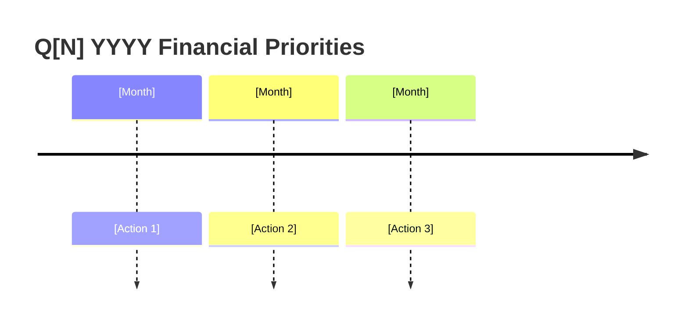

## Cadence
Quarterly (Jan, Apr, Jul, Oct)

## Purpose
Produce a ranked 90-day action plan across all financial dimensions. Run this at the start of each quarter after updating your snapshot. Output is a prioritized list with specific actions — not a summary of your finances.

## Required Input

Paste your current financial snapshot, or say "read latest" to load from `data/snapshots/`.

Also provide (optional but improves output):
- QTD actuals vs budget (if mid-quarter review)
- Any major life changes since last quarter (job change, new debt, new goal)
- Last quarter's top priorities (to check completion)

## Step 1 — Load Snapshot

If the user says "read latest" or similar, use Read to load the most recent file from `data/snapshots/`. Otherwise use the pasted snapshot.

Check the snapshot date — if older than 90 days, warn: "This snapshot is X days old. Key figures may be stale. Consider running `/financial-snapshot` first."

## Step 2 — Assess Each Financial Dimension

Score each dimension on **Urgency** (1–3, how time-sensitive) × **Impact** (1–3, dollar or life impact) = Priority Score (1–9):

| Dimension | What to assess | Urgency signals | Impact signals |
|-----------|---------------|-----------------|----------------|
| **Liquidity** | Emergency fund months of coverage | <3 mo = 3, 3–6 = 2, >6 = 1 | Monthly expenses × gap to 6mo |
| **High-rate debt** | Any revolving debt >10% APR | Balance >$2k = 3, any = 2 | Total interest cost per year |
| **Tax efficiency** | Contribution headroom remaining | Q4 deadline = 3, Q1-Q3 = 2 | Dollar value of headroom left |
| **Goal risk** | Goals projected to miss target date | Miss <12mo = 3, 1-3yr = 2 | Gap to close × time remaining |
| **Investment drift** | Any asset class drifted >5% from target | >10% drift = 3, 5-10% = 2 | Portfolio size × drift magnitude |
| **Cash flow** | Monthly surplus/deficit | Deficit = 3, surplus <$200 = 2 | Annualized surplus/deficit |
| **Insurance/protection** | Obvious gaps (no life ins with dependents, etc.) | Active gap = 3 | Downside exposure |

## Step 3 — Identify Tradeoffs

Check for conflicts between the top priorities:
- Emergency fund vs. investing: if EF < 3 months AND investment drift > 10%, recommend EF first
- Debt paydown vs. 401k match: never sacrifice employer match for debt paydown
- Multiple goals competing for the same surplus: surface the conflict explicitly

## Step 4 — Rank Priorities

Select the top 3–5 dimensions by Priority Score. For each, define:
- **The specific action** (not "invest more" — "direct $X/mo to [account] starting [month]")
- **Expected impact** (dollars saved, months closer to goal, etc.)
- **Effort** (Low / Medium / High — time and cognitive load)
- **Dependency** (what has to happen first)

## Output Structure

### Key Numbers
Display these prominently at the top (bold):
- Net worth, savings rate, emergency fund months, monthly surplus/deficit

### Dimension Scores
| Dimension | Score | Status | Key Metric |
|-----------|-------|--------|------------|
| ... | X/9 | 🔴/⚠️/✓ | ... |

### Priority Ranking
| Rank | Focus Area | Action | Expected Impact | Effort | Dependency |
|------|-----------|--------|-----------------|--------|------------|
| 1 | ... | ... | ... | Low/Med/High | ... |

### Tradeoff Flags
Call out any priorities that conflict, with a recommended resolution.

### 90-Day Action Checklist
A flat numbered list of specific actions in dependency order:
1. [Month X] — [Specific action with amount/account]
2. ...

### Mermaid Timeline
Emit a `timeline` diagram of the action sequence:

## Handoffs
- `/debt-strategy` — if high-rate debt ranks in top 2
- `/investment-review` — if drift ranks in top 2 or it's been >6 months since last review
- `/tax-optimization` — if contribution headroom ranks in top 2, or it's Q3/Q4
- `/goal-modeling` — if any goal is at risk
- `/budget-diagnosis` — if monthly surplus is <$200 or deficit
