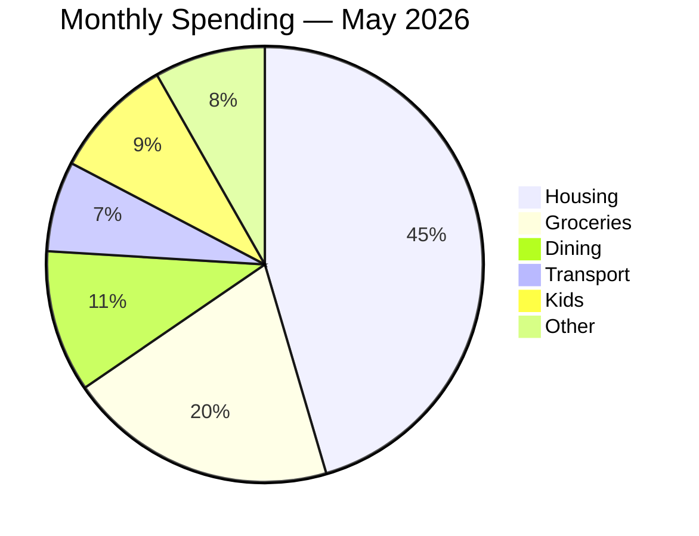
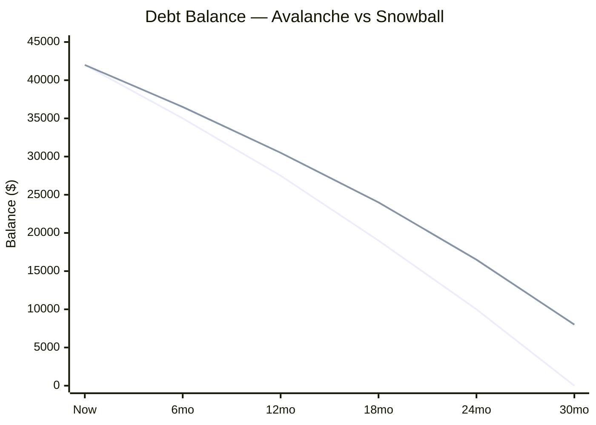
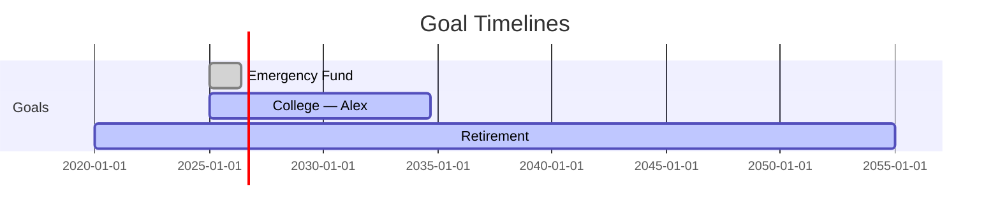

# Technical Design: Phase 1 Skill Suite

## Architecture Overview

Phase 1 is intentionally infrastructure-free. The entire system is a set of markdown files read by Claude Code — no servers, databases, or local services.

```
┌──────────────────────────────────────────────────────────┐
│                     User's Machine                        │
│                                                           │
│  financial-planner/                                       │
│  ├── .claude/commands/      ← 12 skill definitions        │
│  │   ├── financial-snapshot.md                           │
│  │   ├── quarterly-strategy.md                           │
│  │   ├── mermaid.md          ← supporting viz utility    │
│  │   └── ... (8 more)                                    │
│  ├── data/snapshots/        ← Filled snapshot files       │
│  │   ├── template.md        ← Blank template to copy     │
│  │   └── 2026-Q2.md         ← Completed snapshot         │
│  ├── data/sessions/         ← Optional session logs       │
│  └── CLAUDE.md              ← Project context for Claude  │
│                                                           │
│  Claude Code CLI                                          │
│  └── Reads skill → sends prompt + snapshot to API        │
│                         │                                 │
└─────────────────────────┼─────────────────────────────────┘
                          │  Aggregated data only
                          │  (no individual transactions)
                          ▼
                   Claude API (Sonnet/Opus)
```

### Session Flow

```
1. User opens financial-planner project in Claude Code
2. /financial-snapshot  →  fill out or paste existing snapshot
3. /[any skill]         →  paste snapshot when prompted
4. Claude analyzes      →  returns structured output
5. User saves output    →  data/sessions/YYYY-MM-DD-[topic].md (optional)
6. Follow-up skill      →  /[next skill] if handoff recommended
```

---

## Skill File Standard

Every skill is a markdown file in `.claude/commands/`. All skills follow the same internal structure:

```markdown
---
description: [one-line summary shown in /help]
argument-hint: [optional argument label]
allowed-tools: Read, Write   (or none if output-only)
---

## Cadence
[Every session | Monthly | Quarterly | As needed]

## Purpose
[2–3 sentence explanation of what this skill does and when to use it]

## Required Input
[Explicit list of data fields needed — no ambiguity]

## Input Template
[The copy-paste template the user fills out]

## Analysis Framework
[Step-by-step reasoning Claude follows]

## Output Structure
[Required output sections in order]

## Handoffs
[Which skills to suggest and under what conditions]
```

The `allowed-tools: Read, Write` pattern lets skills read the snapshot file from disk and optionally save output — avoiding manual copy-paste when the user has saved their snapshot.

---

## Financial Snapshot Schema

The snapshot is a markdown file the user fills out and saves to `data/snapshots/`. It is the canonical input for all skills. Design goals: human-editable, scannable at a glance, maps cleanly to the Phase 2 DuckDB schema.

### Template: `data/snapshots/template.md`

```markdown
# Financial Snapshot
**Date:** YYYY-MM-DD
**Period:** [e.g., Q2 2026 / May 2026]

---

## Income

| Source            | Gross/Month | Net/Month | Notes                  |
|-------------------|-------------|-----------|------------------------|
| Primary salary    | $           | $         |                        |
| Spouse salary     | $           | $         |                        |
| Rental / side     | $           | $         | irregular — avg        |

**Next expected changes:** [e.g., raise Jul 2026, RSU vest Dec 2026]

---

## Assets

### Liquid & Near-Liquid
| Account              | Balance  | Notes                        |
|----------------------|----------|------------------------------|
| Checking 1           | $        |                              |
| Checking 2           | $        |                              |
| High-yield savings   | $        | emergency fund               |
| High-yield savings   | $        | vehicle fund                 |
| High-yield savings   | $        | vacation fund                |
| High-yield savings   | $        | Christmas fund               |
| Other savings        | $        |                              |

### Tax-Advantaged Investments
| Account                | Balance  | YTD Contributed | Employer YTD |
|------------------------|----------|-----------------|--------------|
| 401k — Traditional     | $        | $               | $            |
| 401k — Roth            | $        | $               | (shared)     |
| Roth IRA               | $        | $               | N/A          |
| HSA                    | $        | $               | $            |
| 529 — [Child 1 name]   | $        | $               | N/A          |
| 529 — [Child 2 name]   | $        | $               | N/A          |
| 529 — [Child 3 name]   | $        | $               | N/A          |
| 529 — [Child 4 name]   | $        | $               | N/A          |

### Taxable Investments
| Account                | Balance  | Notes                        |
|------------------------|----------|------------------------------|
| Brokerage 1            | $        |                              |
| Brokerage 2            | $        |                              |

### Real Assets
| Asset          | Est. Value | Mortgage Balance | Equity  |
|----------------|------------|-----------------|----------|
| Primary home   | $          | $               | $        |

---

## Liabilities

| Debt           | Balance  | Rate   | Min Pmt  | Actual Pmt | Type        |
|----------------|----------|--------|----------|------------|-------------|
| Mortgage       | $        | %      | $        | $          | mortgage    |
| Auto loan      | $        | %      | $        | $          | installment |
| Student loan   | $        | %      | $        | $          | installment |
| Credit card 1  | $        | %      | $        | $          | revolving   |
| Credit card 2  | $        | %      | $        | $          | revolving   |
| Credit card 3  | $        | %      | $        | $          | revolving   |

---

## Monthly Cash Flow

### Fixed Expenses (same every month)
| Category                    | Budget   | Last Month Actual |
|-----------------------------|----------|-------------------|
| Mortgage/Rent               | $        | $                 |
| Auto loan payment           | $        | $                 |
| Insurance (auto/home/life)  | $        | $                 |
| Utilities (avg)             | $        | $                 |
| Subscriptions               | $        | $                 |
| Childcare / tuition         | $        | $                 |

### Variable Expenses
| Category                    | Budget   | Last Month Actual |
|-----------------------------|----------|-------------------|
| Groceries                   | $        | $                 |
| Dining / takeout            | $        | $                 |
| Gas / transportation        | $        | $                 |
| Entertainment               | $        | $                 |
| Kids activities             | $        | $                 |
| Healthcare / copays         | $        | $                 |
| Clothing / personal care    | $        | $                 |
| Home maintenance            | $        | $                 |
| Miscellaneous               | $        | $                 |

### Savings & Investment Contributions
| Category                    | Monthly  | Notes                 |
|-----------------------------|----------|-----------------------|
| 401k (employee portion)     | $        | employer match: $     |
| Roth IRA                    | $        |                       |
| HSA                         | $        | employer contrib: $   |
| 529 contributions           | $        |                       |
| Brokerage                   | $        |                       |
| Extra mortgage principal    | $        |                       |
| Sinking funds               | $        | [car, vacation, etc.] |

**Monthly surplus / deficit:** $[net after all above]

---

## Goals

| Goal                    | Target $  | Target Date | Current $  | Mo. Contribution | Priority |
|-------------------------|-----------|-------------|------------|-----------------|----------|
| Emergency fund (X mo.)  | $         | YYYY-MM     | $          | $               | 1        |
| [Child 1] college       | $         | YYYY        | $          | $               | 2        |
| [Child 2] college       | $         | YYYY        | $          | $               | 3        |
| [Child 3] college       | $         | YYYY        | $          | $               | 3        |
| [Child 4] college       | $         | YYYY        | $          | $               | 3        |
| Vacation fund           | $         | YYYY-MM     | $          | $               | 6        |
| [Car purchase]          | $         | YYYY-MM     | $          | $               | 7        |
| Home down-payment       | $         | YYYY        | $          | $               | 4        |
| Home payoff             | $         | YYYY        | $          | $               | 5        |
| Retirement              | $         | YYYY        | $          | $               | 4        |

---

## Tax Context

| Field                        | Value                                  |
|------------------------------|----------------------------------------|
| Filing status                | MFJ / Single / HOH                     |
| Estimated marginal bracket   | 22% / 24% / 32%                        |
| Estimated effective rate     | %                                      |
| Deduction method             | Standard / Itemized                    |
| Key itemized deductions      | [mortgage interest, charity, etc.]     |
| W-4 withholding on track?    | Yes / No / Unknown                     |
| Tax-loss harvesting opps?    | Yes / No / Unknown                     |

### YTD Contribution Headroom (current tax year)

| Account          | YTD Contributed | Personal Limit | Employer Limit | Remaining |
|------------------|-----------------|----------------|----------------|-----------|
| 401k (all types) | $               | $23,500        | $70,000 total  | $         |
| Roth IRA         | $               | $7,000         | N/A            | $         |
| HSA (family)     | $               | $8,550         | $              | $         |
| 529 (per child)  | $               | $19,000 gift   | N/A            | $         |

---

## Investment Allocation

### Target Allocation (overall portfolio)
| Asset Class              | Target % |
|--------------------------|----------|
| US Stocks — Large Cap    | %        |
| US Stocks — Small/Mid    | %        |
| International Developed  | %        |
| Emerging Markets         | %        |
| Bonds / Fixed Income     | %        |
| REITs                    | %        |
| Cash / Money Market      | %        |

### Current Allocation by Account
| Account          | Holdings / Fund    | Allocation  | Balance  |
|------------------|--------------------|-------------|----------|
| 401k Traditional | [fund name]        | [e.g. 90/10]| $        |
| Roth IRA         | [fund name]        |             | $        |
| HSA              | [fund name]        |             | $        |
| Brokerage 1      | [fund name]        |             | $        |
| Brokerage 2      | [fund name]        |             | $        |
```

---

## Skill Interface Designs

### Skill 1: `financial-snapshot`
**Cadence:** Every session  
**Purpose:** Establish complete financial context before any analytical session. Saves filled template to disk for reuse.

**Inputs:** User fills the template above (or updates an existing file)  
**Core logic:**
1. Present the template and instruct user to fill it out
2. Once submitted, validate each section for completeness — flag blanks and ambiguous fields
3. Compute and display key derived metrics: net worth, savings rate, debt-to-income ratio, emergency fund coverage in months
4. Confirm which analytical skills are most relevant given the snapshot data

**Required output sections:**
- Data completeness check (section-by-section ✓/⚠/✗)
- Key metrics summary (net worth, savings rate, DTI, EF months)
- Suggested next skills based on data
- **Mermaid:** pie chart of net worth composition (liquid / invested / real estate / liabilities)

**File output:** Saves the filled snapshot to `data/snapshots/YYYY-[period].md`

---

### Skill 2: `quarterly-strategy`
**Cadence:** Quarterly  
**Purpose:** Big-picture prioritization across all financial dimensions for the next 90 days.

**Inputs:** Full financial snapshot + QTD actuals vs budget  
**Core logic:**
1. Assess each financial dimension: liquidity, debt, investments, tax, goals, budget
2. Score urgency and impact for each dimension
3. Identify conflicts between competing priorities
4. Rank top 3–5 focus areas with specific 90-day actions

**Required output sections:**
- Snapshot summary (key numbers at a glance)
- Priority ranking table (rank, area, action, expected impact, effort)
- Tradeoff flags (where priorities conflict)
- 90-day action checklist
- **Mermaid:** timeline diagram of the top 90-day action sequence with milestone markers

---

### Skill 3: `scenario-compare`
**Cadence:** As needed  
**Purpose:** Model 2+ alternatives for a major financial decision with visual comparison and parameter sensitivity.

**Inputs:** Decision description, scenario parameters, relevant snapshot sections  
**Core logic:**
1. Extract key decision variables and their ranges
2. Model each scenario across: net cost/gain, cash flow impact, opportunity cost, risk, timeline
3. Identify the key assumption that most changes the recommendation
4. Support follow-up questions to vary parameters interactively

**Required output sections:**
- Decision summary and scenarios defined
- Side-by-side comparison table (ASCII)
- Sensitivity analysis (which variable matters most)
- Recommendation with confidence level
- Follow-up prompts for parameter variation (e.g., "Ask me: what if the rate is X instead?")
- **Mermaid:** xychart-beta showing each scenario's cumulative financial outcome over the decision horizon

---

### Skill 4: `debt-strategy`
**Cadence:** Monthly / as needed  
**Purpose:** Optimal debt paydown ordering and refinancing assessment.

**Inputs:** Liabilities section of snapshot + available monthly surplus for debt paydown  
**Core logic:**
1. List debts sorted by rate (avalanche) and balance (snowball)
2. Model both strategies with payoff timeline and total interest
3. Flag any debt above refi threshold (e.g., >6% fixed, >8% variable)
4. Show payoff acceleration scenarios (e.g., +$200/mo to debt)

**Required output sections:**
- Debt summary table (sorted, with payoff dates)
- Avalanche vs snowball comparison
- Refinancing opportunities (if any)
- Recommended action with rationale
- **Mermaid:** xychart-beta of total debt balance over time (avalanche vs snowball lines); gantt of per-debt payoff dates

---

### Skill 5: `investment-review`
**Cadence:** Quarterly  
**Purpose:** Allocation drift detection, rebalancing plan, and contribution optimization.

**Inputs:** Investment allocation section + tax context (for account type decisions)  
**Core logic:**
1. Compute current vs target allocation across all accounts combined
2. Identify positions drifted >5% from target
3. Generate rebalancing actions prioritizing tax-advantaged accounts first
4. Optimize contribution routing across 401k/Roth/HSA/brokerage based on tax situation and remaining headroom

**Required output sections:**
- Current vs target allocation table with drift
- Rebalancing actions (buy X, sell Y, rebalance via contributions)
- Contribution optimization plan (where to direct next dollars)
- **Mermaid:** two pie charts side by side — current allocation vs target allocation

---

### Skill 6: `tax-optimization`
**Cadence:** Quarterly + year-end  
**Purpose:** Year-round tax positioning — identify savings opportunities and time-sensitive actions.

**Inputs:** Tax context section + YTD contribution headroom + investment allocation (for TLH)  
**Core logic:**
1. Compute remaining contribution headroom against all limits (personal + employer)
2. Assess bracket management opportunities (Roth conversion, income deferral)
3. Identify tax-loss harvesting candidates
4. Check withholding adequacy
5. Flag year-end deadline items if Q4

**Required output sections:**
- Contribution headroom table (all accounts, remaining amounts)
- Top tax-saving opportunities (ranked, with dollar estimate where possible)
- Year-end deadline checklist (only shown in Q3/Q4)
- Recommended actions
- **Mermaid:** xychart-beta bar chart of YTD contributed vs remaining headroom per account

---

### Skill 7: `goal-modeling`
**Cadence:** Quarterly  
**Purpose:** Gap analysis and timeline projection across all financial goals.

**Inputs:** Goals section + savings/investment contributions section  
**Core logic:**
1. Project each goal to completion using current balance + monthly contribution + assumed return
2. Compare projected vs target date; flag goals that miss by >3 months
3. Model impact of redirecting contributions between goals
4. Suggest contribution adjustments to bring at-risk goals back on track

**Required output sections:**
- Goal progress table (current %, projected completion date, status)
- At-risk goals list with gap and suggested fix
- Contribution reallocation scenarios (if applicable)
- Recommended adjustments
- **Mermaid:** gantt chart with one bar per goal — shaded portion = progress, end marker = target date vs projected date

**ASCII fallback (in terminals without Mermaid rendering):**
```
Emergency Fund  ████████████░░░░  75%  On track  (Jun 2026)
College — Alex  ████░░░░░░░░░░░░  28%  ⚠ Behind   (need +$150/mo)
Retirement      ██░░░░░░░░░░░░░░  14%  On track  (2055)
```

---

### Skill 8: `budget-diagnosis`
**Cadence:** Monthly  
**Purpose:** Identify spending leaks, track envelope health, and manage month-to-month rollovers.

**Inputs:** Monthly cash flow section (budget vs actuals) + prior month actuals if available  
**Core logic:**
1. Compare actuals to budget for each category
2. Compute envelope status: healthy / at-risk / overdrawn
3. For overdrawn envelopes, identify donor envelopes with surplus to borrow from
4. Apply rollover logic for irregular categories (e.g., car maintenance, medical) and savings goals
5. Identify top 3 overspend categories and suggest specific cuts

**Required output sections:**
- Envelope status table (category, budget, actual, variance, status)
- At-risk / overdrawn flags with borrowing suggestions
- Rollover tracker (categories with accumulated balance)
- Top 3 overspend analysis with specific reduction ideas
- Revised budget recommendation for next month
- **Mermaid:** xychart-beta grouped bar chart of budget vs actual by category; pie chart of spending composition

**Envelope status format:**
```
Category          Budget   Actual   Variance   Status
─────────────────────────────────────────────────────
Groceries         $800     $923     -$123      ⚠ At risk
Dining            $300     $487     -$187      🔴 Overdrawn
Entertainment     $150     $62      +$88       ✓ Surplus
Car maintenance   $100     $0       +$100      ↩ Rollover (+$340 acc.)
```

---

### Skill 9: `cash-flow-optimizer`
**Cadence:** Monthly / as needed  
**Purpose:** Bill timing optimization, cash flow gap detection, and automation planning.

**Inputs:** Income dates, bill due dates, fixed/variable split from snapshot  
**Core logic:**
1. Map income and outflows onto a monthly calendar
2. Identify periods where cumulative outflows exceed cumulative inflows (gap risk)
3. Recommend bill timing adjustments to smooth cash flow
4. Suggest which bills to automate and in what order

**Required output sections:**
- Cash flow gap risk periods (with mitigation strategies)
- Bill timing recommendations
- Automation priority list
- **Mermaid:** xychart-beta line chart of cumulative cash balance across the month, with gap-risk periods highlighted

**ASCII calendar fallback:**
```
Week 1  [Pay $4,200]  Mortgage -$2,100  → Buffer: $2,100
Week 2                Car ins  -$180    → Buffer: $1,920
Week 3  [Pay $4,200]  Utilities -$220   → Buffer: $5,900
Week 4                Credit card -$500 → Buffer: $5,400
```

---

### Skill 10: `net-worth-tracker`
**Cadence:** Monthly / quarterly  
**Purpose:** Track net worth over time, visualize trends, and assess progress toward financial independence benchmarks.

> **Note:** This is the proposed 10th skill to resolve the open question from requirements. Confirm before implementation.

**Inputs:** Current snapshot (assets + liabilities) + prior snapshot(s) for trend  
**Core logic:**
1. Compute total assets, total liabilities, net worth
2. Break down net worth by category (liquid, invested, real estate, minus debts)
3. If prior snapshots available, show month-over-month and quarter-over-quarter change
4. Compare to FI benchmarks (e.g., 1x salary by 30, 3x by 40 rule of thumb)

**Required output sections:**
- Net worth summary (assets − liabilities = net worth)
- Composition breakdown table
- Trend if prior snapshots available (MoM / QoQ delta)
- Benchmark comparisons
- Key observations and next skill to run
- **Mermaid:** xychart-beta line chart of net worth over time (if prior snapshots exist); pie chart of asset composition

---

### Skill 11: `financial-health-score`
**Cadence:** Quarterly / session opener  
**Purpose:** Holistic scorecard across all financial dimensions. Run this first when you're not sure where to focus, or at the start of a quarterly review before invoking more targeted skills.

**Inputs:** Full financial snapshot  
**Core logic:**
1. Score each of 6 dimensions on a 0–100 scale using key snapshot metrics:
   - **Liquidity:** emergency fund months of coverage (target: 6mo = 100)
   - **Debt health:** DTI ratio and absence of high-rate revolving debt (target: DTI <15%, no >10% debt = 100)
   - **Savings rate:** net savings as % of gross income (target: ≥20% = 100)
   - **Investment diversification:** allocation drift from target across all accounts (target: all assets within 5% = 100)
   - **Goal progress:** % of goals on track for target date (target: all on track = 100)
   - **Tax efficiency:** % of available tax-advantaged contribution headroom utilized (target: ≥80% utilized = 100)
2. Flag the lowest-scoring dimension as the session priority
3. If prior snapshot exists, show score delta per dimension

**Required output sections:**
- Scorecard table (dimension / score / status / key metric / trend vs prior)
- Bottom 2–3 dimensions flagged with specific "what's dragging this down" explanation
- Recommended session plan: which skills to run in priority order
- **Mermaid:** `xychart-beta` bar chart of scores per dimension (0–100 scale)

---

### Skill 12: `mermaid` _(supporting utility)_
**Cadence:** Called from within any analytical skill session  
**Purpose:** Generate Mermaid diagram syntax for a given financial dataset. A pure visualization utility — it does no financial analysis. Other skills invoke it at the end of their output section when they emit a **Mermaid:** line.

**Inputs:** Diagram type + the relevant data extracted from the active skill's analysis (passed inline — no separate snapshot needed)

**Supported diagram types and financial use cases:**

| Mermaid Type | Use Cases |
|---|---|
| `pie` | Asset allocation (current vs target), spending composition, net worth breakdown |
| `xychart-beta` | Debt balance decline over time, net worth trend, cash flow calendar, budget vs actual bars, contribution headroom |
| `gantt` | Goal timelines (projected vs target), debt payoff sequence |
| `timeline` | Quarterly action plan milestones, key financial events |

**Core logic:**
1. Receive the diagram type and data values from the calling skill's output
2. Emit valid, ready-to-render Mermaid syntax in a fenced ` ```mermaid ` block
3. Add a plain-English caption below the diagram explaining what it shows
4. If the data is ambiguous, ask one clarifying question before rendering

**Example outputs:**

Spending breakdown (pie):
````

````

Debt paydown (xychart-beta):
````

````

Goal timeline (gantt):
````

````

**Handoffs:** None — this is a terminal utility skill. Return to the calling skill's action list after rendering.

---

## Universal Output Standards

Every skill output must conform to these standards (NF-04, NF-06, NF-07):

### Required Sections (all skills)

1. **Data received** — confirm inputs, flag any missing/ambiguous fields
2. **Key metrics** — 3–5 most important numbers at a glance (bolded)
3. **Analysis** — skill-specific content
4. **Visualizations** — Mermaid diagram(s) per the skill's **Mermaid:** spec, with ASCII fallback tables where noted
5. **Action list** — numbered, prioritized, specific (not "consider investing more")
6. **Handoffs** — "If you want to go deeper, run: `/[skill]`"

### Visualization Approach

**Primary:** Mermaid diagrams via `/mermaid`. Each skill's interface design lists the exact diagram type and data to render. Skills emit the diagram inline — the user does not need to invoke `/mermaid` manually; the skill calls it as part of its output.

**Fallback:** ASCII patterns for terminals or contexts where Mermaid doesn't render:

Progress bar (goal-modeling fallback):
```
Goal Name   ████████░░░░░░░░  50%   On track / ⚠ Behind / 🔴 At risk
```

Cash flow calendar (cash-flow-optimizer fallback):
```
Week 1  [Pay $4,200]  Mortgage -$2,100  → Buffer: $2,100
Week 3  [Pay $4,200]  Utilities -$220   → Buffer: $5,900
```

**Mermaid diagram type selection guide:**

| Use case | Diagram type |
|---|---|
| Proportional breakdown (allocation, spending) | `pie` |
| Trends and comparisons over time | `xychart-beta` (line) |
| Budget vs actual by category | `xychart-beta` (bar) |
| Goal / debt timelines with dates | `gantt` |
| Action plan milestones | `timeline` |

---

## File Storage Conventions

```
financial-planner/
├── .claude/
│   └── commands/
│       ├── financial-snapshot.md
│       ├── quarterly-strategy.md
│       ├── scenario-compare.md
│       ├── debt-strategy.md
│       ├── investment-review.md
│       ├── tax-optimization.md
│       ├── goal-modeling.md
│       ├── budget-diagnosis.md
│       ├── cash-flow-optimizer.md
│       ├── net-worth-tracker.md
│       ├── financial-health-score.md
│       └── mermaid.md               ← visualization utility
├── data/
│   ├── snapshots/
│   │   ├── template.md        ← blank template; never edit directly
│   │   ├── 2026-Q1.md         ← filled quarterly snapshots
│   │   ├── 2026-Q2.md
│   │   └── 2026-05.md         ← monthly if more frequent updates needed
│   └── sessions/              ← optional; save notable session outputs
│       └── 2026-05-16-quarterly-review.md
├── CLAUDE.md                  ← project instructions for Claude
└── .gitignore                 ← ignore data/ (financial data stays local)
```

**Naming conventions:**
- Quarterly snapshots: `YYYY-QN.md`
- Monthly snapshots: `YYYY-MM.md`
- Sessions: `YYYY-MM-DD-[skill]-[topic].md`

**`.gitignore` must include `data/`** — financial data must not be committed to any remote.

---

## CLAUDE.md Design

The project-level `CLAUDE.md` primes Claude at the start of every session:

```markdown
# Financial Planner

This is a personal financial planning project using Claude Code skills.

## How to use
1. Start sessions with `/financial-snapshot` (or paste an existing snapshot)
2. Invoke skills by name: `/quarterly-strategy`, `/debt-strategy`, etc.
3. Snapshots are saved in `data/snapshots/`. Read the latest one with Read tool.

## Privacy rules
- Never ask for individual transaction data — category totals only
- All data stays local; never suggest external tools or services
- Snapshot files in `data/` are gitignored and must stay local

## Output style
- Lead with numbers, not narration
- Every session ends with a numbered action list
- Flag which skill to run next
- Keep it concise
```

---

## Security Considerations

| Concern | Design Response |
|---------|----------------|
| Raw transaction exposure | Skills explicitly instruct to use category-level aggregates only — template has no transaction fields |
| Cloud data boundary | Only what the user pastes into the session is sent to Claude API — snapshots on disk are never automatically uploaded |
| Credential exposure | Skills have no credential fields; account numbers are not part of the snapshot schema |
| Accidental git commit | `data/` in `.gitignore`; CLAUDE.md reminds user |
| Snapshot file access | `allowed-tools: Read` scoped to `data/snapshots/` only |

---

## Phase 2 Migration Path

The snapshot schema is designed to map directly to the Phase 2 DuckDB schema:

| Snapshot Section | Phase 2 Table |
|-----------------|---------------|
| Assets (liquid) | `account_balances` |
| Tax-advantaged investments | `account_balances` + `contribution_ytd` |
| Liabilities | `debts` |
| Monthly cash flow | `budget_envelopes` + `monthly_actuals` |
| Goals | `goals` |
| Investment allocation | `portfolio_allocation` |

When Phase 2 lands, the `financial-snapshot` skill is replaced by an MCP server that reads live data — all other skills remain unchanged.

---

## Technical Risks and Mitigations

| Risk | Likelihood | Impact | Mitigation |
|------|-----------|--------|------------|
| Context window overflow (large snapshot + skill prompt) | Medium | High | Keep snapshot template concise; skills request only relevant sections |
| Snapshot staleness (user forgets to update) | High | Medium | Each skill prompts "When was this snapshot last updated?" at the top |
| 10th skill scope creep | Low | Low | `net-worth-tracker` is intentionally narrow; resolve before tasks phase |
| Tax year limit changes | High (annual) | Low | Contribution limits are in the snapshot template, not hardcoded in skills; user updates annually |
| Phase 2 schema divergence | Low | Medium | Snapshot section names match Phase 2 table names by design |
| Skills become stale after AU move | Medium (future) | Medium | AU migration is a Phase 6 concern; skills are parameterized enough to adapt |
